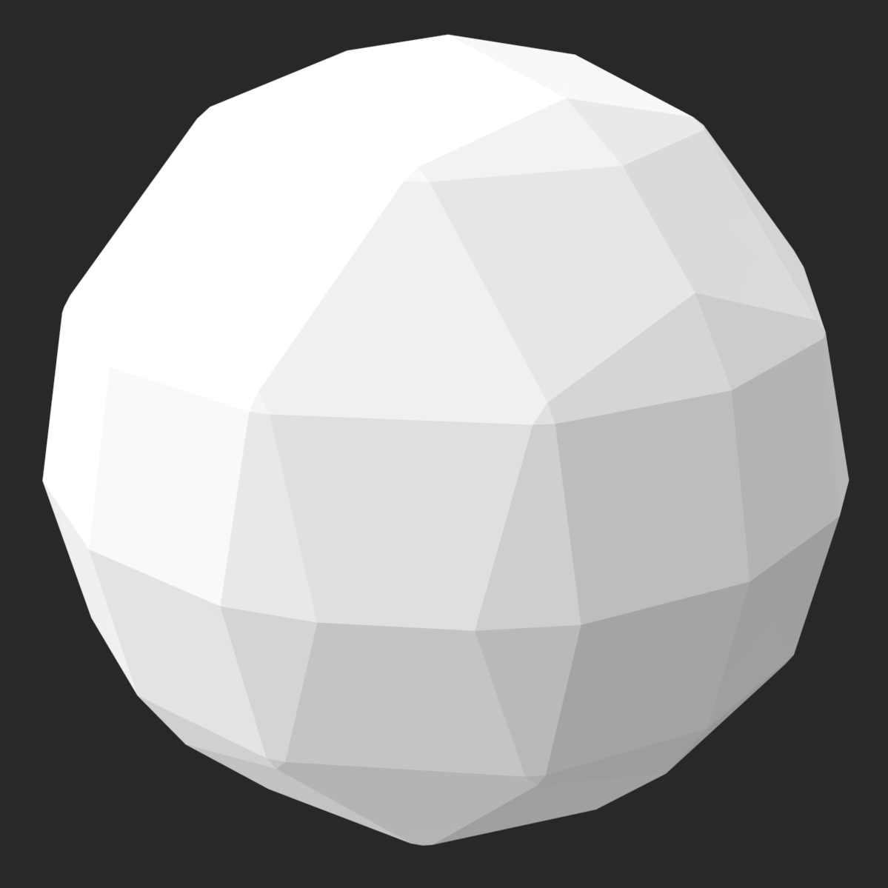

# A simple marching cubes implementation

- [Original paper](https://dl.acm.org/doi/pdf/10.1145/37402.37422)
- [Helpful resource](https://paulbourke.net/geometry/polygonise/)

Usage:
```zsh
>cargo run --release

Cube count: 7880599
Vertices: 943872
Triangles: 314624

Exported: marched.stl
Time: 0 min 1.48 seconds
```

|||
|:-:|:-:|
|||
|||

### Future improvements
- Multiprocessing with [Rayon](https://crates.io/crates/rayon)
- Optimize to reduce redundant queries
- Expression evaluator with something like [evalexpr](https://crates.io/crates/evalexpr)